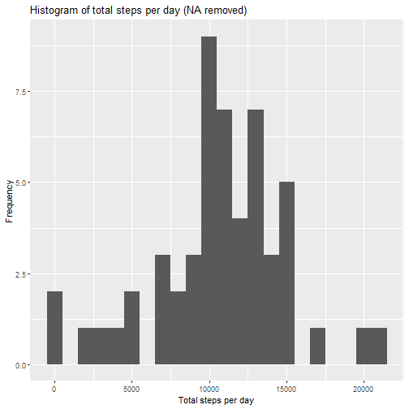
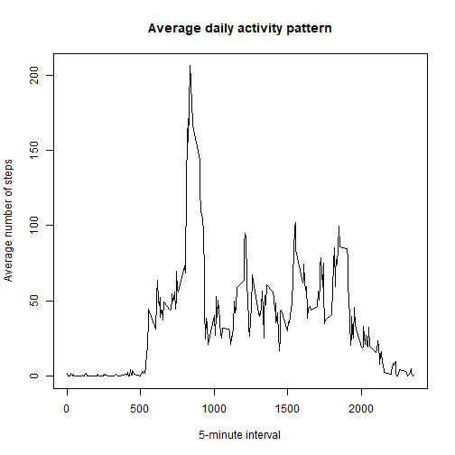
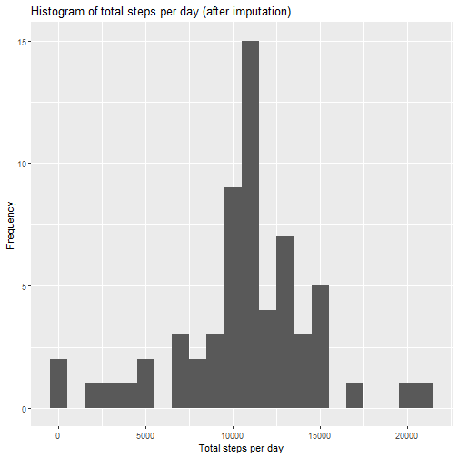
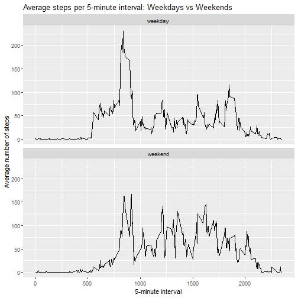

## A. Preparing data for analysis


``` r
knitr::opts_chunk$set(echo = TRUE)

library(ggplot2)

# Load the data
activity <- read.csv("activity.csv", stringsAsFactors = FALSE)

# Convert date column
activity$date <- as.Date(activity$date)

# Inspect the data
str(activity)
```

```
## 'data.frame':	17568 obs. of  3 variables:
##  $ steps   : int  NA NA NA NA NA NA NA NA NA NA ...
##  $ date    : Date, format: "2012-10-01" "2012-10-01" ...
##  $ interval: int  0 5 10 15 20 25 30 35 40 45 ...
```

``` r
summary(activity)
```

```
##      steps             date               interval     
##  Min.   :  0.00   Min.   :2012-10-01   Min.   :   0.0  
##  1st Qu.:  0.00   1st Qu.:2012-10-16   1st Qu.: 588.8  
##  Median :  0.00   Median :2012-10-31   Median :1177.5  
##  Mean   : 37.38   Mean   :2012-10-31   Mean   :1177.5  
##  3rd Qu.: 12.00   3rd Qu.:2012-11-15   3rd Qu.:1766.2  
##  Max.   :806.00   Max.   :2012-11-30   Max.   :2355.0  
##  NA's   :2304
```

## B. What is the mean total number of steps taken per day?

For this part of the assignment, missing values are ignored to establish a baseline.


``` r
steps_per_day <- aggregate(steps ~ date, data = activity, sum, na.rm = TRUE)
head(steps_per_day)
```

```
##         date steps
## 1 2012-10-02   126
## 2 2012-10-03 11352
## 3 2012-10-04 12116
## 4 2012-10-05 13294
## 5 2012-10-06 15420
## 6 2012-10-07 11015
```


``` r
ggplot(steps_per_day, aes(x = steps)) +
  geom_histogram(binwidth = 1000) +
  labs(
    title = "Histogram of total steps per day (NA removed)",
    x = "Total steps per day",
    y = "Frequency"
  )
```




``` r
mean_steps <- mean(steps_per_day$steps)
median_steps <- median(steps_per_day$steps)

mean_steps
```

```
## [1] 10766.19
```

``` r
median_steps
```

```
## [1] 10765
```

## C. What is the average daily activity pattern?


``` r
avg_by_interval <- aggregate(steps ~ interval, data = activity, mean, na.rm = TRUE)
head(avg_by_interval)
```

```
##   interval     steps
## 1        0 1.7169811
## 2        5 0.3396226
## 3       10 0.1320755
## 4       15 0.1509434
## 5       20 0.0754717
## 6       25 2.0943396
```


``` r
plot(
  avg_by_interval$interval,
  avg_by_interval$steps,
  type = "l",
  xlab = "5-minute interval",
  ylab = "Average number of steps",
  main = "Average daily activity pattern"
)
```




``` r
avg_by_interval[which.max(avg_by_interval$steps), ]
```

```
##     interval    steps
## 104      835 206.1698
```

## D. Imputing missing values


``` r
sum(is.na(activity$steps))
```

```
## [1] 2304
```

Missing values are imputed using the mean number of steps for each 5-minute interval across all days.


``` r
interval_means <- avg_by_interval
names(interval_means)[2] <- "interval_mean"

activity_imputed <- merge(activity, interval_means, by = "interval", all.x = TRUE)
activity_imputed <- activity_imputed[order(activity_imputed$date, activity_imputed$interval), ]

na_idx <- is.na(activity_imputed$steps)
activity_imputed$steps[na_idx] <- activity_imputed$interval_mean[na_idx]
activity_imputed$interval_mean <- NULL

sum(is.na(activity_imputed$steps))
```

```
## [1] 0
```


``` r
steps_per_day_imputed <- aggregate(steps ~ date, data = activity_imputed, sum)

ggplot(steps_per_day_imputed, aes(x = steps)) +
  geom_histogram(binwidth = 1000) +
  labs(
    title = "Histogram of total steps per day (after imputation)",
    x = "Total steps per day",
    y = "Frequency"
  )
```




``` r
mean(steps_per_day_imputed$steps)
```

```
## [1] 10766.19
```

``` r
median(steps_per_day_imputed$steps)
```

```
## [1] 10766.19
```

## E. Are there differences in activity patterns between weekdays and weekends?


``` r
activity_imputed$day_type <- ifelse(
  weekdays(activity_imputed$date) %in% c("Saturday", "Sunday"),
  "weekend",
  "weekday"
)
activity_imputed$day_type <- factor(activity_imputed$day_type)

table(activity_imputed$day_type)
```

```
## 
## weekday weekend 
##   12960    4608
```


``` r
avg_interval_daytype <- aggregate(steps ~ interval + day_type, data = activity_imputed, mean)

ggplot(avg_interval_daytype, aes(x = interval, y = steps)) +
  geom_line() +
  facet_wrap(~ day_type, ncol = 1) +
  labs(
    title = "Average steps per 5-minute interval: Weekdays vs Weekends",
    x = "5-minute interval",
    y = "Average number of steps"
  )
```


